# Dash0 Lambda Extension Architecture Report

## Overview

The **Dash0 Lambda Extension** is an AWS Lambda extension written in Rust that provides observability and monitoring capabilities for Lambda functions across multiple runtimes (Python, Node.js, Java).

The extension acts as an **intelligent proxy** between your Lambda function and AWS, providing:
- **Auto-instrumentation** - Automatically adds tracing without code changes
- **Trace Collection** - Captures distributed traces via OpenTelemetry
- **Log Correlation** - Links logs to traces using trace IDs
- **Runtime Error Detection** - Detects timeouts and OOM errors
- **Metadata Enrichment** - Adds Lambda-specific context to telemetry

---

## Diagram 1: Lambda Lifecycle & Extension Architecture

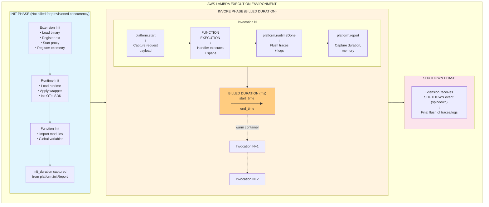

### Timing Data Captured by Extension

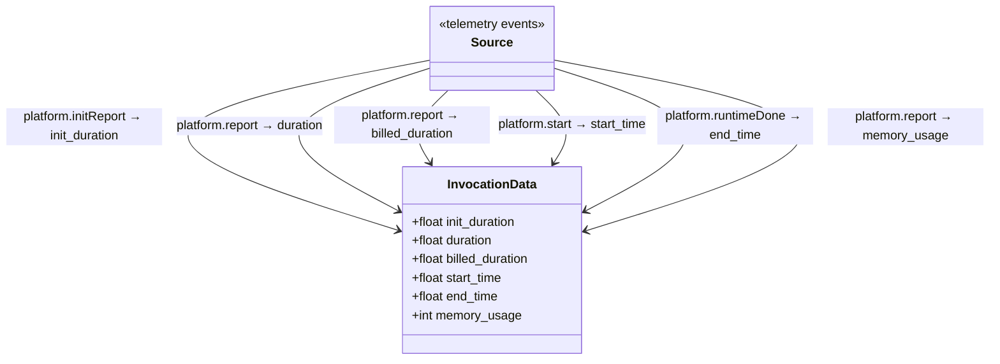

---

## Diagram 2: New Lambda Sandbox Startup Sequence

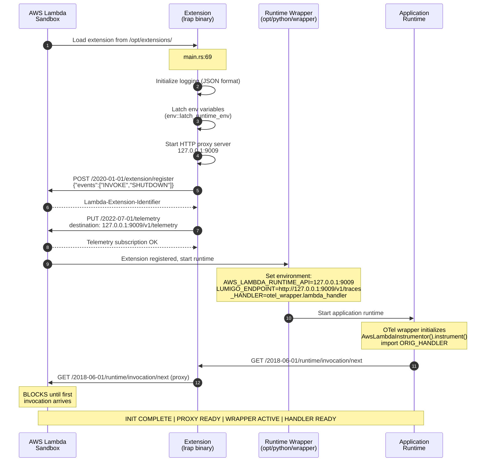

---

## Diagram 3: Payload Interception Flow

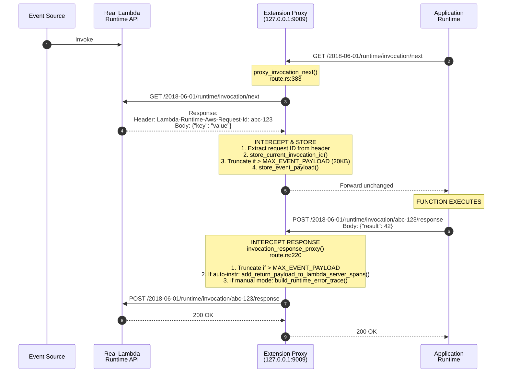

### In-Memory Storage Structure

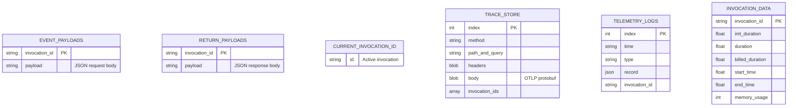

---

## Diagram 4: Data Export Flow

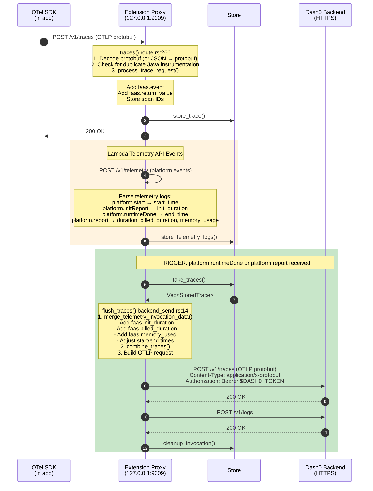

### Export Configuration

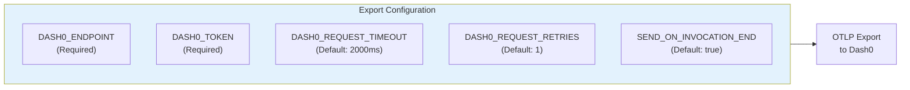

---

## Diagram 5: Lambda Runtime Awareness

### 5.1 Environment Variable Integration

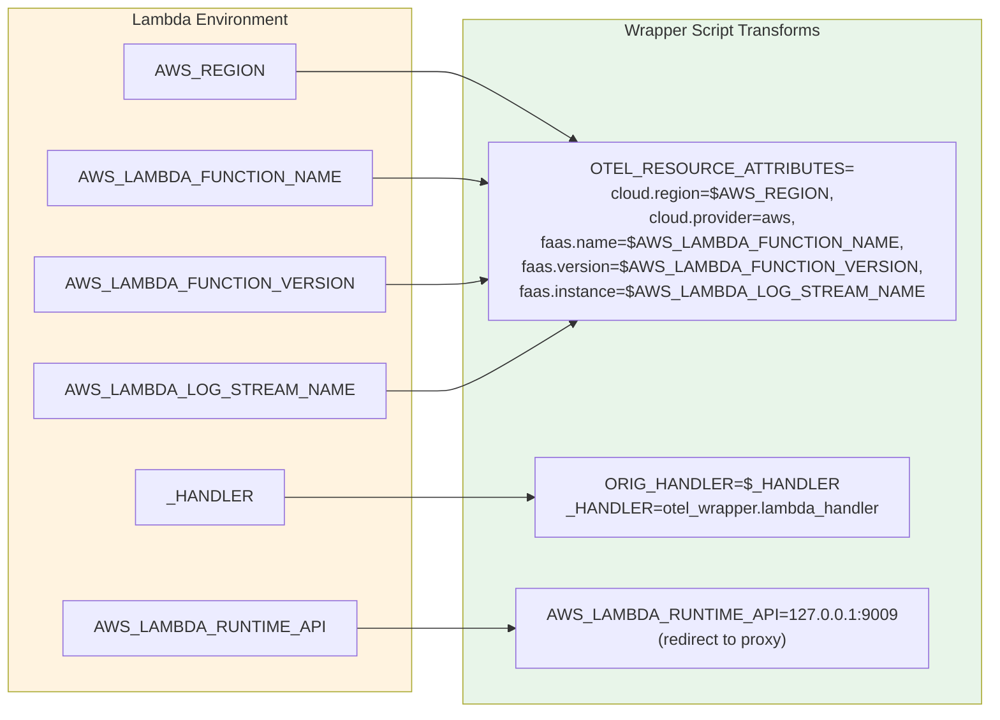

### 5.2 Extension API Integration

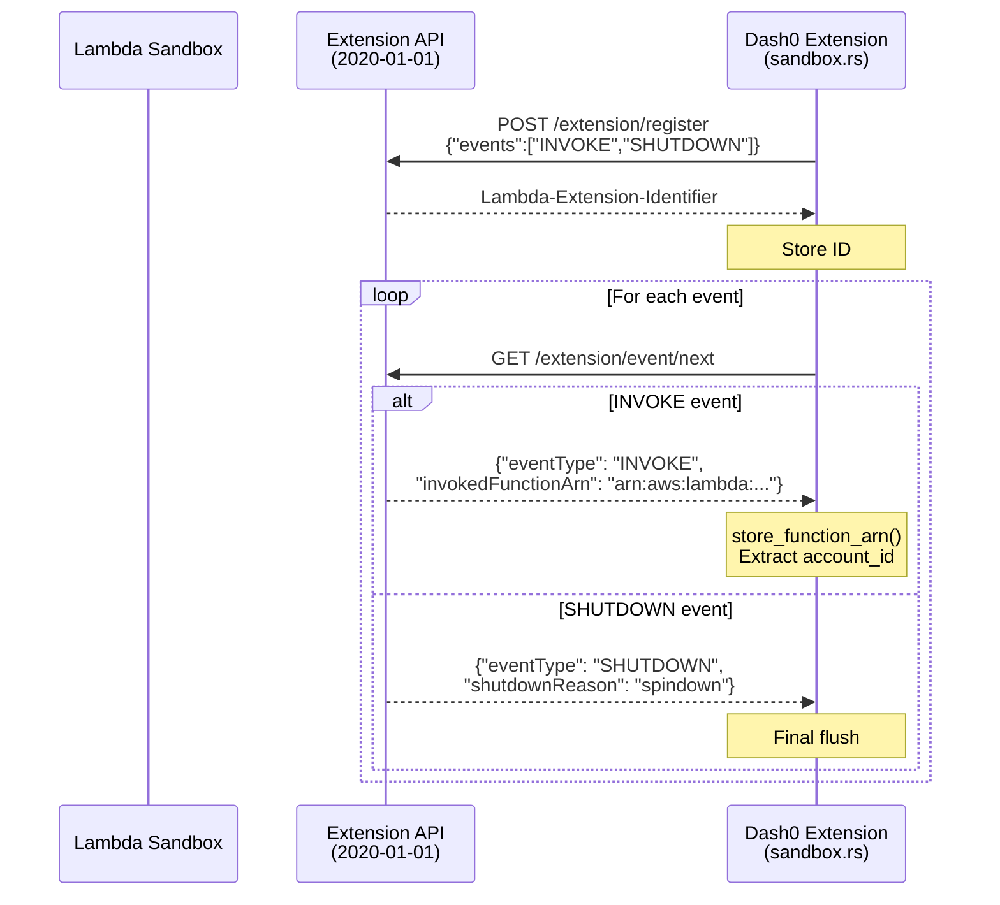

### 5.3 Telemetry API Integration

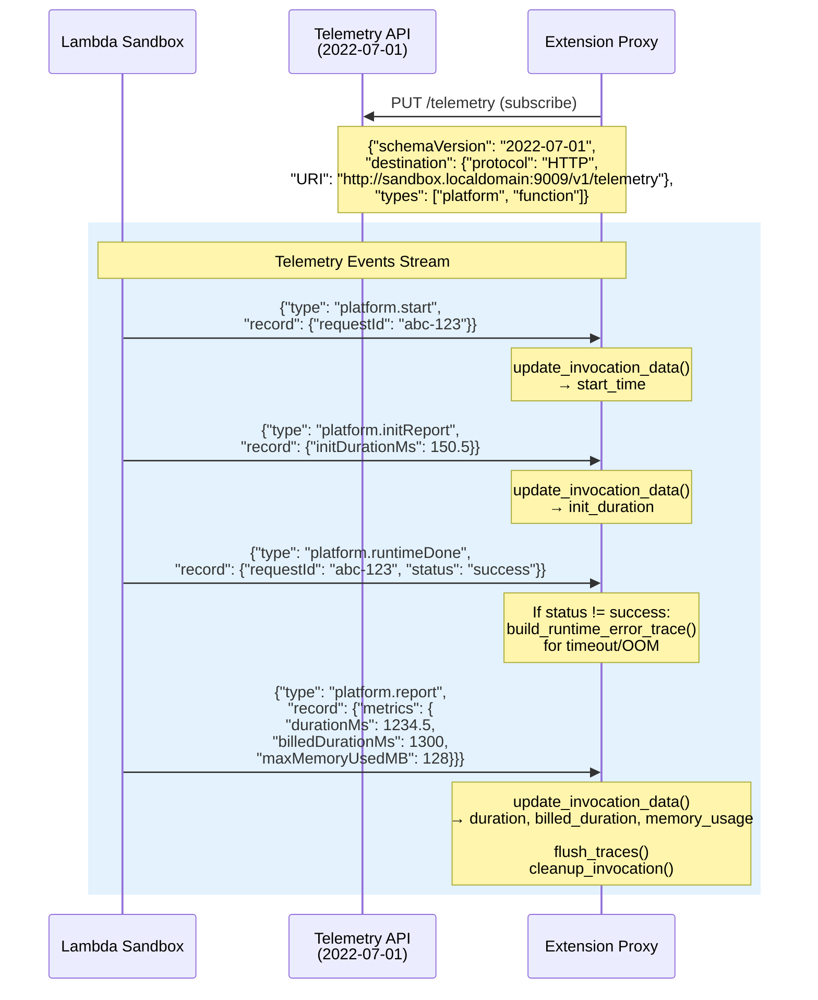

### 5.4 Runtime-Specific Instrumentation

```mermaid
flowchart TB
    subgraph PYTHON["Python Runtime"]
        PW["opt/python/wrapper"]
        PO["opt/python/otel_wrapper.py"]

        PW -->|"PYTHONPATH=/opt/python<br/>_HANDLER=otel_wrapper.lambda_handler"| PO
        PO -->|"import lumigo_opentelemetry<br/>AwsLambdaInstrumentor().instrument()"| PS["Scope: opentelemetry.instrumentation.aws_lambda"]
    end

    subgraph NODE["Node.js Runtime"]
        NW["opt/node/wrapper"]
        NI["opt/node/init.mjs"]

        NW -->|"NODE_OPTIONS=--import /opt/node/init.mjs"| NI
        NI -->|"import { NodeSDK } from<br/>'@opentelemetry/sdk-node'"| NS["Scope: @opentelemetry/instrumentation-aws-lambda"]
    end

    subgraph JAVA["Java Runtime"]
        JW["opt/java/wrapper"]
        JA["lumigo-otel-javaagent.jar"]

        JW -->|"JAVA_TOOL_OPTIONS=<br/>-javaagent:/opt/lumigo-otel-javaagent.jar"| JA
        JA --> JS1["Scope: io.opentelemetry.aws-lambda-core-1.0"]
        JA --> JS2["Scope: io.opentelemetry.aws-lambda-events-2.2"]

        JS1 --> DEDUP["drop_duplicate_java_instrumenations()<br/>filters duplicate spans"]
        JS2 --> DEDUP
    end

    subgraph MANUAL["Manual Instrumentation"]
        DIS["DISABLE_AUTO_INSTRUMENTATION=true"]
        DIS --> SYN["Extension creates synthetic traces<br/>for ALL invocations"]
        SYN --> CAP["Captures:<br/>• faas.invocation_id<br/>• cloud.resource_id<br/>• faas.event<br/>• faas.return_value"]
        SYN --> ERR["Detects errors from:<br/>• errorMessage/errorType in response<br/>• statusCode >= 400"]
    end

    style PYTHON fill:#fff9c4
    style NODE fill:#c8e6c9
    style JAVA fill:#ffccbc
    style MANUAL fill:#e1bee7
```

---

## Summary: End-to-End Observability Pipeline

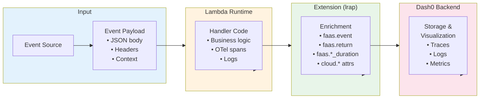

### Data Enrichment Points

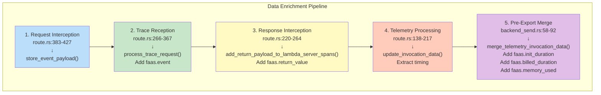

---

## Code References

| Component | File | Key Functions |
|-----------|------|---------------|
| Entry point | `src/main.rs:69` | `#[tokio::main] async fn main()` |
| HTTP routing | `src/route.rs:28` | `make_route()` |
| Payload interception | `src/route.rs:383` | `proxy_invocation_next()` |
| Response interception | `src/route.rs:220` | `invocation_response_proxy()` |
| Trace processing | `src/route.rs:266` | `traces()` |
| Telemetry processing | `src/route.rs:138` | `telemetry_sink()` |
| Extension registration | `src/sandbox.rs:180` | `extension::register()` |
| Telemetry subscription | `src/sandbox.rs:423` | `extension::register_telemetry()` |
| Trace enrichment | `src/util/span_mutations.rs:316` | `add_event_payload_to_lambda_server_spans()` |
| Export | `src/backend_send.rs:58` | `send_traces()` |
| Storage | `src/store.rs` | All storage functions |

---

*Generated from codebase analysis of dash0-lambda-extension*
