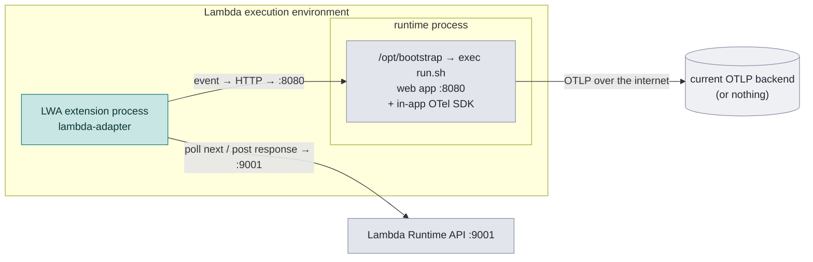
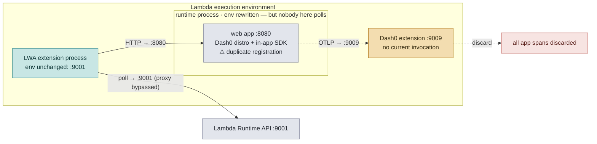
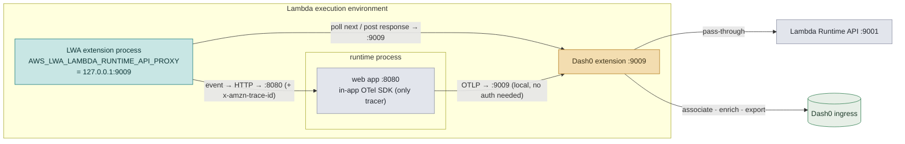
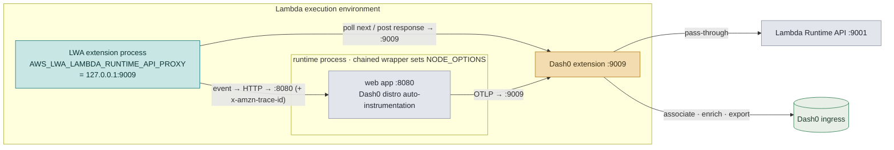
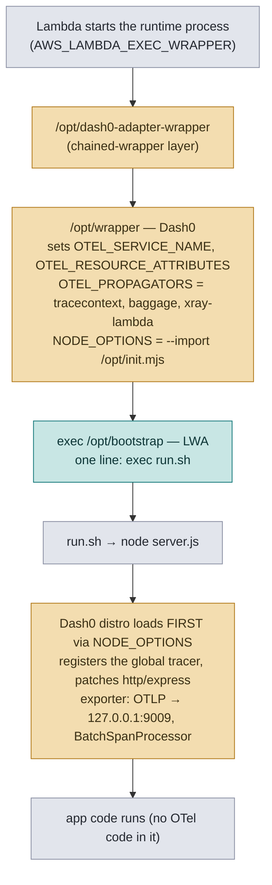
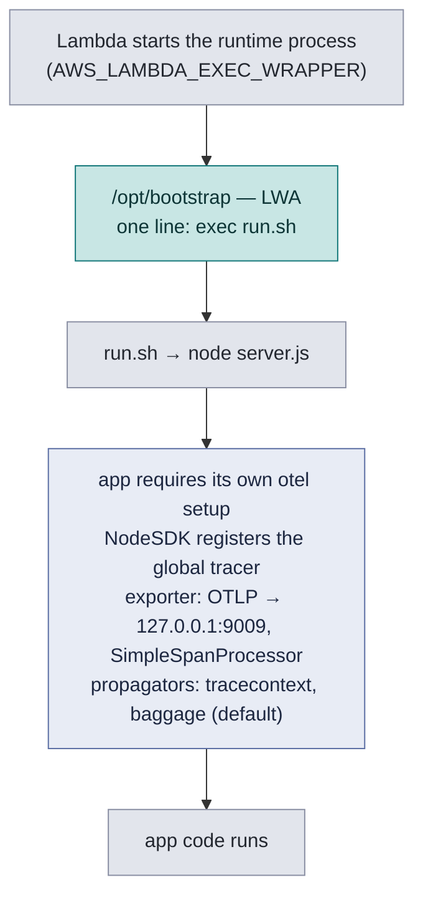
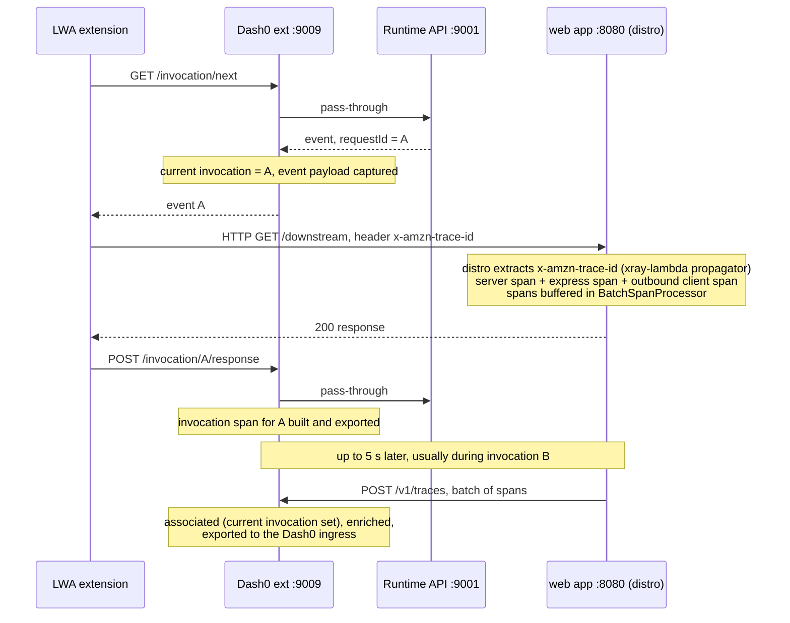
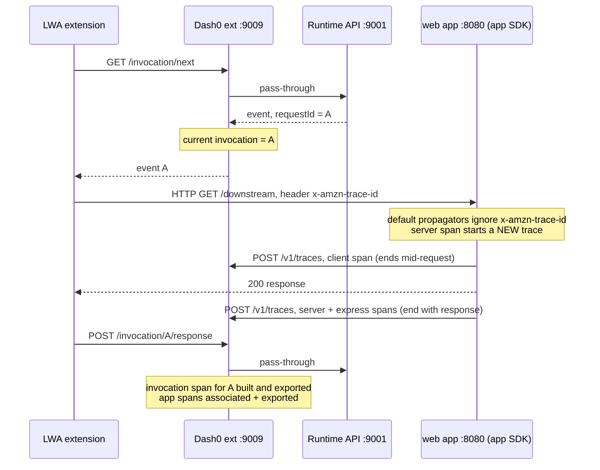
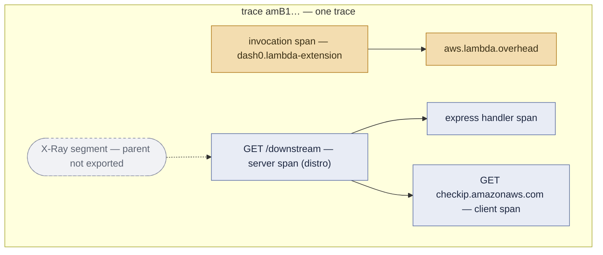
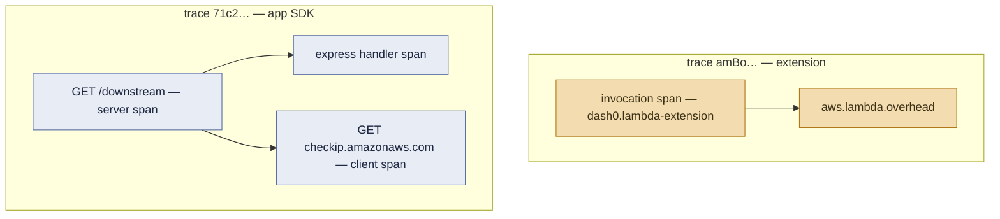

# Adding Dash0 to a Lambda Web Adapter function — the two options

**Context:** SUP-1312 / Starling Bank. A web app runs on AWS Lambda behind the
[AWS Lambda Web Adapter](https://github.com/awslabs/aws-lambda-web-adapter) (LWA).
The team wants Dash0 monitoring on the same function. Out of the box the two
products compete for the single `AWS_LAMBDA_EXEC_WRAPPER` slot, and the
community chained-wrapper workaround produced
`@opentelemetry/api: Attempted duplicate registration` errors.

This document compares the **current state** with the **two supported target
states**, both verified end-to-end in AWS on 2026-07-22 (playground in this
directory, results in the [README](README.md), wiring details in
[proxy-chains.md](proxy-chains.md)).

**Ports used throughout:** `:9001` = real Lambda Runtime API ·
`:9009` = Dash0 extension (Runtime API proxy **and** OTLP receiver on one port) ·
`:8080` = the web app.

---

## Current state

### What runs today (Web Adapter, no Dash0)

The function works, but produces no Dash0 telemetry. The app's own OpenTelemetry
SDK (if initialized) exports wherever it is currently pointed, over the internet,
in the request path.



**Configuration today:**

```
Handler:  run.sh
Layers:   LambdaAdapterLayerX86
Env:      AWS_LAMBDA_EXEC_WRAPPER=/opt/bootstrap
          PORT=8080
          (in-app SDK exporter config, e.g. OTEL_EXPORTER_OTLP_ENDPOINT=…)
```

### What was attempted (chained wrapper) — and why it fails

Chaining `AWS_LAMBDA_EXEC_WRAPPER` (Dash0 wrapper → LWA bootstrap) looks right
but breaks on two independent points, both reproduced in the playground:

1. **The Dash0 proxy is silently bypassed.** Exec wrappers can only modify the
   *runtime process*. LWA's runtime loop runs in its **extension process**
   (`/opt/extensions/lambda-adapter`), which keeps the original
   `AWS_LAMBDA_RUNTIME_API=:9001`. The Dash0 extension never sees an
   invocation, so it discards every span the app sends it
   (`"/v1/traces has no invocation IDs"` — 42/42 exports in testing).
2. **Two SDKs in one process.** The chained wrapper injects Dash0's
   auto-instrumentation via `NODE_OPTIONS`; if the app also initializes its own
   OTel SDK, the second registration is rejected:
   `Attempted duplicate registration of API: context`. The app keeps serving,
   but the in-app SDK is silently inert.



### The key that unlocks both options

LWA has a first-class setting for exactly this situation:

```
AWS_LWA_LAMBDA_RUNTIME_API_PROXY=127.0.0.1:9009
```

It tells LWA to run its invocation loop **through a runtime-API proxy**. Because
it is a *function-level environment variable*, it reaches LWA's extension
process — which no exec wrapper ever could. With it set, the Dash0 extension
sees every invocation again, and everything downstream (span association,
payload capture, enrichment) works. Both options below rely on it.

---

## Option A — keep the in-app OTel SDK (recommended for Starling)

**For teams that own and want to keep their OpenTelemetry setup.** The app's SDK
stays the only tracer in the process; the Dash0 extension becomes its local,
non-blocking export target and adds invocation spans and FaaS metrics on top.
This was verified as playground scenario 09.



### Changes, old → new

| | Old | New |
|---|---|---|
| Handler | `run.sh` | unchanged |
| `AWS_LAMBDA_EXEC_WRAPPER` | `/opt/bootstrap` | **unchanged** — no chaining |
| Layers | LWA | LWA + **`dash0-extension-node`** |
| New env vars | — | `AWS_LWA_LAMBDA_RUNTIME_API_PROXY=127.0.0.1:9009`<br/>`DASH0_ENDPOINT=https://ingress.<region>.aws.dash0.com:4318`<br/>`DASH0_TOKEN=…` (or `DASH0_TOKEN_SECRET_ARN`) |
| App code | SDK exports to current backend | exporter URL → **`http://127.0.0.1:9009`**; token config removed from app |
| Remove | any chained-wrapper workaround | — |

Concretely, the app-side diff is one line (plus optionally the propagator):

```js
// before
new OTLPTraceExporter({ url: 'https://<their-backend>/v1/traces', headers: { … } })
// after — token stays in the extension, call never leaves the sandbox
new OTLPTraceExporter({ url: 'http://127.0.0.1:9009/v1/traces' })
```

Optional but recommended: add the X-Ray Lambda propagator
(`@opentelemetry/propagator-aws-xray-lambda`) to the SDK. LWA already forwards
`x-amzn-trace-id` to the app; with the propagator, the app's traces join the
extension's invocation spans in one trace (without it they arrive as separate,
uncorrelated traces — still complete, just not stitched).

### What you get / what to know

- ✅ No duplicate registration — one SDK per process, by construction.
- ✅ App spans + extension invocation spans + FaaS metrics in Dash0
  (verified: 100% of requests, previously 100% discarded).
- ✅ Export is local; the Dash0 token never lives in app code.
- ⚠️ Trace correlation requires the X-Ray propagator (see above).
- ⚠️ Spans that end after the response is posted ride on the next invocation's
  thaw; the last spans before a long idle arrive late. Use a
  `SimpleSpanProcessor` (or flush before responding) rather than a plain batch
  processor.

---

## Option B — remove the in-app SDK, let Dash0 auto-instrument

**For teams that would rather delete their OTel plumbing.** Dash0's
auto-instrumentation loads into the web app via the chained wrapper and traces
express/HTTP/outbound calls automatically. Verified as playground scenario 08 —
including trace correlation out of the box (21/22 traces).



The chained wrapper is a one-liner shipped as a tiny layer (or in the function
bundle) — see [`chained-wrapper-layer/dash0-adapter-wrapper`](chained-wrapper-layer/dash0-adapter-wrapper):

```bash
exec /opt/wrapper /opt/bootstrap "$@"
```

Dash0's `/opt/wrapper` sets up the OTel environment and `NODE_OPTIONS`, then
hands off to LWA's `/opt/bootstrap`, which starts the web app with the
instrumented environment.

### Changes, old → new

| | Old | New |
|---|---|---|
| Handler | `run.sh` | unchanged |
| `AWS_LAMBDA_EXEC_WRAPPER` | `/opt/bootstrap` | **`/opt/dash0-adapter-wrapper`** (chained) |
| Layers | LWA | LWA + `dash0-extension-node` + chained-wrapper layer |
| New env vars | — | `AWS_LWA_LAMBDA_RUNTIME_API_PROXY=127.0.0.1:9009`<br/>`DASH0_ENDPOINT=…`<br/>`DASH0_TOKEN=…` |
| App code | in-app OTel SDK init | **deleted** (and its OTel dependencies) |

### What you get / what to know

- ✅ Zero OTel code in the app; instrumentation updates arrive with layer updates.
- ✅ Server + express + outbound-HTTP spans, correlated with the extension's
  invocation spans in the same trace out of the box (the distro ships the
  `xray-lambda` propagator).
- ✅ Payload log records, enrichment, secret masking — the full extension feature set.
- ⚠️ The in-app SDK **must** be removed; keeping it recreates the
  duplicate-registration error (that is Option A's territory).
- ⚠️ The distro batches spans (5s); under sparse traffic the last batch arrives
  on the next invocation. Same freeze/thaw caveat as Option A.
- ⚠️ Minor known gap: the app's server span parents onto the X-Ray segment, so
  the trace tree shows one missing-parent hop (extension polish item).

---

## Side-by-side

| | **Option A** — keep in-app SDK | **Option B** — Dash0 auto-instrumentation |
|---|---|---|
| Playground scenario | 09 | 08 |
| `AWS_LAMBDA_EXEC_WRAPPER` | untouched (`/opt/bootstrap`) | chained (`/opt/dash0-adapter-wrapper`) |
| App code changes | exporter URL (1 line), optional propagator | delete OTel init + dependencies |
| Who owns instrumentation | the team | Dash0 layer |
| Trace correlation | with X-Ray propagator added | built-in (21/22 verified) |
| Custom/manual spans | full control | via `@opentelemetry/api` against the distro's provider |
| Duplicate-registration risk | none (one SDK) | none (SDK removed) |
| Blast radius of migration | smallest | app dependency change |

**Recommendation:** Starling already has a working, tuned OTel setup → start
with **Option A** (four env-ish changes, one-line app diff, nothing removed).
Option B is the destination for teams that want out of the instrumentation
business entirely. Both can be trialed side by side — that is exactly what the
playground deploys.

**Shared open item (Dash0-side):** extension log export currently returns
200 OK but records were not queryable in the test dataset — do not promise log
delivery until that is resolved (see README finding 6). Traces and FaaS metrics
are verified working in both options.

---

## Deep dive: scenario 08 vs 09 mechanics

Both scenarios share the same invocation plumbing (LWA polls through the Dash0
proxy via `AWS_LWA_LAMBDA_RUNTIME_API_PROXY`). They differ in **how the tracer
gets into the app process**, **when spans are exported**, and **what the
resulting trace looks like**.

### Cold start: how the tracer gets into the process

**Scenario 08** — the chained wrapper injects the Dash0 distro before any app
code runs:



**Scenario 09** — no wrapper chaining; the app initializes its own SDK as it
does today:



The one-registration rule is satisfied differently: in 08 the distro registers
first and is the *only* SDK (the app must not init one); in 09 the app SDK
registers first and is the only SDK (no `NODE_OPTIONS` injection happens).

### One warm request, end to end

**Scenario 08** — spans are batched by the distro and typically leave the
process on a *later* thaw:



**Scenario 09** — `SimpleSpanProcessor` exports each span the moment it ends,
mostly inside the same invocation window:



### What lands in Dash0: trace shapes

**Scenario 08 — one correlated trace per request** (verified 21/22). The
distro's `xray-lambda` propagator stitches app spans into the same trace as the
extension's invocation span. Known polish item: the server span's parent is the
X-Ray segment (not exported), so the tree shows one missing hop.



**Scenario 09 — two parallel traces per request** (as deployed, without the
X-Ray propagator in the app SDK). Both are complete; they are just not stitched
together. Adding `@opentelemetry/propagator-aws-xray-lambda` to the app SDK
should merge them into the 08 shape.



### Mechanics side by side

| | **08 — auto-instrumentation** | **09 — in-app SDK** |
|---|---|---|
| Tracer enters the process via | `NODE_OPTIONS --import /opt/init.mjs` (chained wrapper) | app's own `require('./otel')` |
| Global registration order | distro first, nothing else allowed | app SDK first, nothing else present |
| Span processor | `BatchSpanProcessor` (max 5 s delay, distro default) | app's choice — `SimpleSpanProcessor` tested |
| Export timing | batches, often during the *next* invocation | per span, mostly within the same invocation |
| Export target | `127.0.0.1:9009` (distro default) | `127.0.0.1:9009` (one-line app change) |
| Propagators | `tracecontext, baggage, xray-lambda` (set by wrapper) | SDK defaults (`tracecontext, baggage`) unless extended |
| Trace correlation with invocation span | ✅ built-in (21/22 verified) | ❌ as deployed; ✅ expected with the X-Ray propagator |
| `OTEL_SERVICE_NAME`, resource attrs | set by the Dash0 wrapper | app/function config |
| Instrumentation coverage | distro's full set (http, express, aws-sdk, pg, redis, …) | whatever the app installs |
| Risk if the other tracer sneaks in | app SDK init → duplicate-registration error | chained wrapper added → same error, reversed |
| Spans at risk of arriving late | last batch before a long idle | spans that end after the response is posted |
