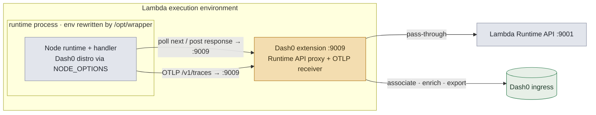
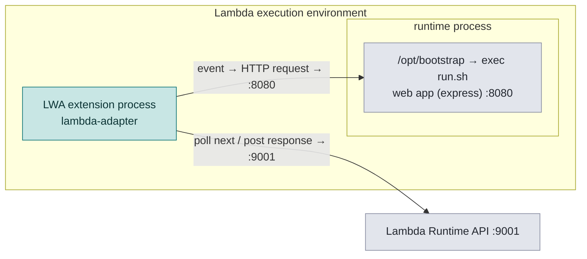
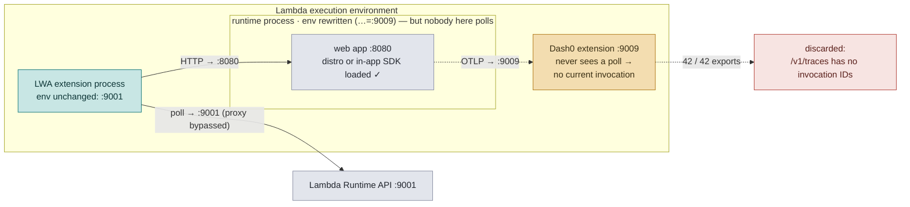
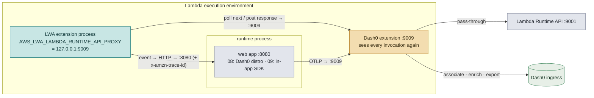

# SUP-1312 · Proxy chains: Dash0 extension × Lambda Web Adapter

How each side works alone, why chaining `AWS_LAMBDA_EXEC_WRAPPER` silently bypasses
the Dash0 proxy, and the `AWS_LWA_LAMBDA_RUNTIME_API_PROXY` configuration that makes
the combination work. All verified in eu-west-1 (see [README](README.md)).

Ports: **:9001** = real Lambda Runtime API · **:9009** = Dash0 extension (Runtime API
proxy + OTLP receiver on one port).

## Scenario 02 — Dash0 alone: how the extension normally sees everything ✅

The exec wrapper rewrites `AWS_LAMBDA_RUNTIME_API` *inside the runtime process*, so the
runtime polls for events through the extension. Seeing every poll is what powers the
extension: invocation spans, payload capture, and the **current invocation ID** that
incoming OTLP spans get associated with.

## Scenario 01 — Web Adapter alone: the runtime loop lives in LWA's extension process ✅

LWA's `/opt/bootstrap` is one line — `exec run.sh` — turning the runtime process into
the web app. The Lambda↔HTTP translation happens in `/opt/extensions/lambda-adapter`,
a separate process Lambda starts with the **original** environment. The important
asymmetry: exec wrappers can only change the runtime process's environment — extension
processes are out of reach.

## Scenarios 03/04/05/06 — chained wrapper: why the Dash0 proxy is bypassed ❌

The chained wrapper (`exec /opt/wrapper /opt/bootstrap`) delivers everything env-based —
`OTEL_*`, `NODE_OPTIONS` — into the app (instrumentation demonstrably loads). But the
process that actually polls the Runtime API is LWA's extension, whose environment still
says `:9001`. The Dash0 extension never sees a poll, has no current invocation, and
discards every OTLP export from the app: `"/v1/traces has no invocation IDs"`.

Scenario 04 adds the second collision on top: distro + in-app SDK in one process →
`Attempted duplicate registration of API: context`.

## Scenarios 08/09 — the fix: `AWS_LWA_LAMBDA_RUNTIME_API_PROXY=127.0.0.1:9009` ✅

LWA's own knob for runtime-API-proxy extensions. As a **function-level** env var it
reaches LWA's extension process, routing the invocation loop through the Dash0 proxy —
the one thing the wrapper never could. LWA registers against the real Runtime API and
only routes the invocation loop through the proxy, so there is no registration conflict.

- **Scenario 09 (recommend to Starling):** keep `/opt/bootstrap`, keep their in-app SDK,
  exporter → `http://127.0.0.1:9009`; add the `xray-lambda` propagator for trace
  correlation with the extension's invocation spans.
- **Scenario 08 (full Dash0):** chained wrapper + this knob → auto-instrumented,
  correlated traces (21/22) with zero app changes.

